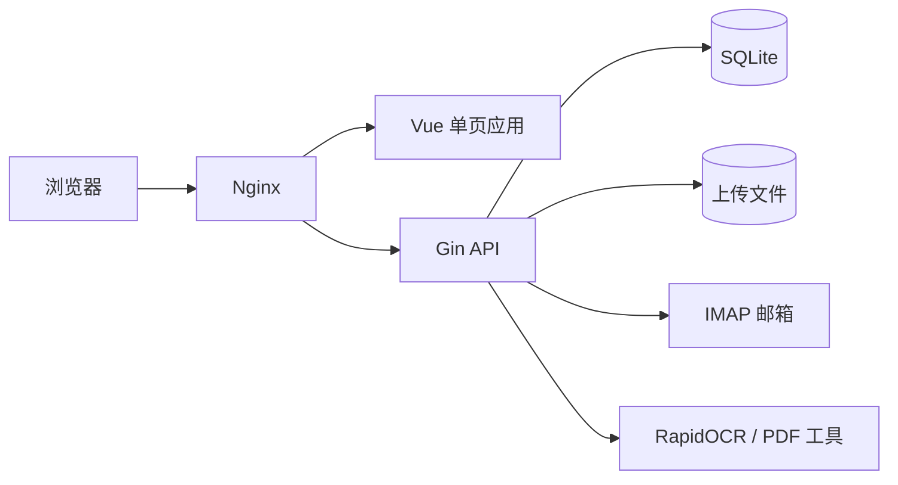

# Smart Bill Manager 架构说明

本文描述 v0.2.0 重构后的模块边界、数据一致性规则和扩展约束。目标不是追求抽象数量，而是让 HTTP、业务、持久化、文件系统和前端状态各自拥有清晰责任。

## 系统上下文

统一容器由 Supervisor 管理 Nginx 和 Go 服务。Nginx 提供前端静态资源并反向代理 `/api`；上传文件不直接暴露，文件读取必须经过后端鉴权。

## 后端分层

| 层 | 目录 | 责任 | 不应承担 |
| --- | --- | --- | --- |
| 启动与装配 | `cmd/server`、`internal/app` | 配置加载、依赖装配、路由、worker 生命周期、优雅停机 | 领域查询和业务判断 |
| HTTP 适配 | `internal/handlers`、`internal/middleware` | 参数解析、鉴权上下文、状态码、响应格式 | 跨资源事务和直接文件清理 |
| 业务服务 | `internal/services` | 用例编排、事务边界、OCR/邮箱/行程规则 | 全局数据库状态 |
| 数据访问 | `internal/repository` | 所有者过滤、查询、分页、金额字段同步 | HTTP 响应和业务流程编排 |
| 数据模型 | `internal/models` | GORM 映射和序列化结构 | 隐式访问数据库 |
| 迁移 | `internal/migrations` | 表结构同步、一次性数据变换、迁移记录 | 请求期兼容修复 |
| 基础设施 | `pkg/database` | SQLite 连接、连接池和 PRAGMA | 应用级单例 |

`app.New` 显式接收配置和数据库，将同一连接注入各领域服务。服务再创建自己的仓储，不再依赖可变的全局 DB。这样测试可以使用隔离数据库，应用也能明确关闭连接。

## 数据与事务边界

### 版本化迁移

启动顺序为：打开数据库、同步当前结构、创建 `schema_migrations`、依版本执行迁移、最后启动 HTTP 和后台任务。每个注册迁移在独立事务中运行，只有数据变换成功后才写入版本记录。

迁移遵循以下约束：

1. 发布后的版本号和逻辑不可修改，修复必须新增更高版本；
2. 数据库版本高于程序支持版本时拒绝启动；
3. 数据回填必须可重复验证，并提供 SQLite 集成测试；
4. 迁移失败必须向上返回，不能记录日志后继续运行。

### 金额精度

支付金额、发票金额和税额使用整数分字段参与筛选、聚合和比较。旧版浮点元字段在兼容期内继续双写，所有持久化入口必须调用金额同步逻辑，避免单边更新。

### 数据库与文件系统

数据库事务不能原子覆盖文件系统，因此采用明确的提交顺序：

1. 创建流程先写临时或用户隔离文件，再提交数据库；数据库失败时回收新文件；
2. 删除流程先在事务内删除数据库关系和记录，提交成功后再清理文件；
3. 文件删除只允许发生在已校验的上传根目录内；
4. 草稿清理先事务化移除记录，再处理对应文件，失败文件留给后续运维清理。

仓储的 `WithDB(tx)` 会创建绑定事务的副本，确保服务在一个事务中执行的查询和更新不会意外回到基础连接。

## 身份与错误边界

- JWT 由认证服务验证，业务 handler 从中间件上下文获取当前用户。
- 普通用户只能访问自己的 `owner_user_id`；管理员读取全量或代操作时仍经过显式规则。
- 管理员代操作的写请求需要 `X-Act-As-Confirmed: 1`，前端收到确认挑战后才允许重试。
- 可预期的 4xx 业务错误保留可操作信息；5xx 只返回通用消息，内部错误写入服务端日志。
- 生产配置必须提供至少 32 字符的 JWT 密钥，且 CORS 不允许通配符。

## 前端分层

| 层 | 目录 | 责任 |
| --- | --- | --- |
| 请求基础设施 | `src/api/client.ts` | Axios 实例、超时、并发限制、鉴权头、401 和代操作确认 |
| 本地持久化 | `src/api/storage.ts` | token、用户和代操作目标的 localStorage 读写 |
| 领域 API | `src/api/*.ts` | 认证、支付、发票、行程、邮箱和任务接口 |
| 跨页面状态 | `src/stores` | 认证会话、通知、主题 |
| 可复用流程 | `src/composables` | 任务轮询、分页加载和竞态处理 |
| 领域组件 | `src/components` | 对话框、图表、布局等有明确输入输出的 UI 单元 |
| 路由页面 | `src/views` | 页面编排、筛选条件和用户交互 |

认证状态以 Pinia store 为唯一运行时来源，token 与用户作为一个会话整体写入或清除。401 会同时清除本地会话和管理员代操作状态。

分页与任务轮询通过 composable 统一处理加载、错误、取消和过期响应。页面卸载或发起新请求后，旧响应不得覆盖当前页面状态。

## 后台任务生命周期

应用根上下文统一控制异步 OCR task worker、草稿清理和常驻 OCR worker。收到 SIGTERM 或中断信号时：

1. 停止接收新的 HTTP 请求；
2. 取消根上下文，通知后台 worker 退出；
3. 在 15 秒超时内等待 HTTP 和后台任务结束；
4. 关闭 SQLite 连接。

新增后台任务必须接收应用上下文并提供可等待的退出信号，不能启动无法停止的孤立 goroutine。

## 质量门禁

每个合入 `main` 的变更必须经过：

- 后端 CGO 测试、统一覆盖率 profile、整体覆盖率不低于 25%、`go vet`；
- 前端依赖审计、ESLint 零警告、Vitest、TypeScript 和 Vite 构建；
- 完整统一 Docker 镜像构建。

v0.2.0 后端整体语句覆盖率为 35.8%。应用装配、迁移和服务层已有可用基线，但 handler 集成覆盖仍偏低。后续测试投入应优先覆盖支付、发票、认证、管理员代操作和文件下载的 HTTP 契约，而不是只追求整体百分比。

前端历史页面中的显式 `any` 通过 ESLint suppression 锁定存量，新增代码不得扩大基线；共享 API、store、composable 和工具层已经使用明确类型并配有单元测试。

## 扩展规则

新增领域功能时按以下顺序落位：

1. 在模型和版本化迁移中定义持久化变化；
2. 在仓储中实现带所有者约束的数据访问；
3. 在服务中定义事务和跨资源流程；
4. 在 handler 中完成 HTTP 参数与响应适配；
5. 在前端领域 API 中封装接口，再由 store、composable 或组件消费；
6. 为业务规则补单元测试，为事务、所有者隔离和迁移补集成测试。

不得重新引入全局数据库、从页面直接创建 Axios 实例、在 handler 中跨多表写入，或绕过鉴权暴露上传目录。
