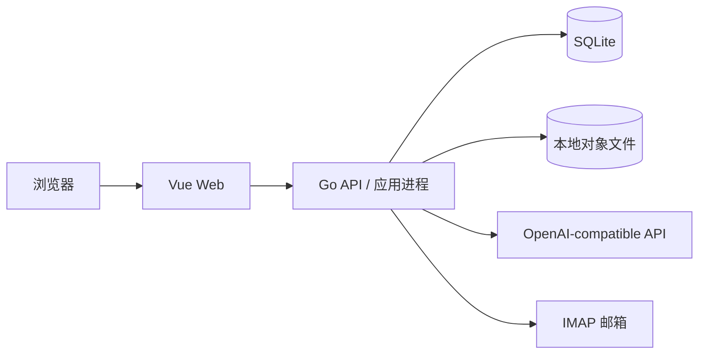
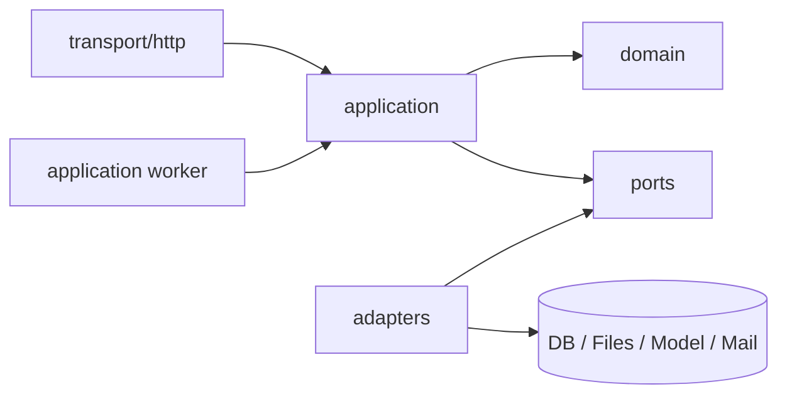
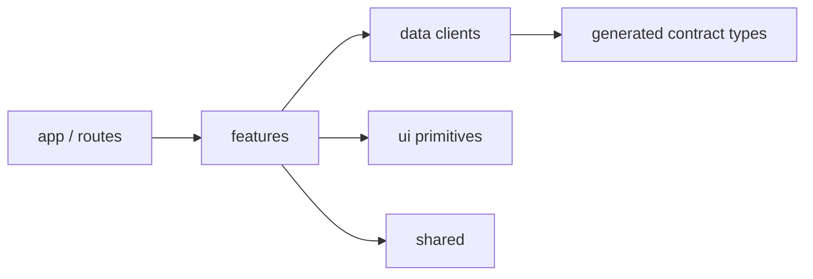
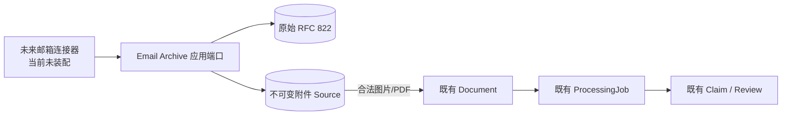
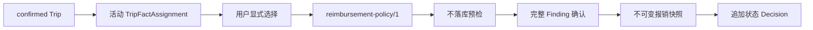
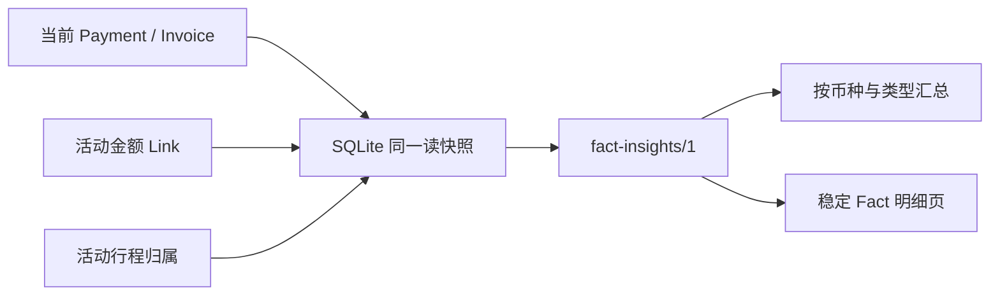

# Clean Slate 架构基线

状态：M0、M1、M2、M3 已完成；M4 首切片“确定性 Fact 洞察与筛选查询”已完成，下一断点为完整备份恢复演练
适用对象：Smart Bill Manager 新系统
非适用对象：`backend-go/`、`frontend/` 和旧部署

## 架构目标

新系统采用模块化单体：一个部署单元、清晰领域边界、持久化任务和可替换基础设施端口。目标是确保财务事实只能由经过审核的候选结果产生，而不是追求微服务数量或技术新颖度。

## 系统上下文



M1、M2 只启用 Browser、Web、API、SQLite、文件存储和模型 API。M3 只在该模块化单体内增加连接器中立的邮件归档、行程归属和报销工作流；不装配邮箱网络连接，也不为报销连接外部系统。真实邮箱与外部报销系统接入仍在独立门禁之后。

## 目标目录

```text
apps/
├── api/
│   ├── cmd/server/
│   ├── cmd/bootstrap-owner/
│   └── internal/
│       ├── domain/
│       ├── application/
│       ├── ports/
│       ├── adapters/
│       └── transport/http/
└── web/
    └── src/
        ├── app/
        ├── features/
        ├── data/
        ├── ui/
        └── shared/
contracts/
├── openapi/
└── schemas/
docs/
infra/
├── docker/
└── migrations/
tests/
├── contract/
├── integration/
├── e2e/
└── evals/
tools/
```

版本号不进入永久目录名。旧目录在新架构开发期间存在于同一分支，也不能成为新代码依赖。

## 后端依赖方向



### domain

负责实体、值对象、状态转换和无基础设施依赖的业务不变量。

- 不 import HTTP、数据库、文件系统或具体模型客户端。
- 金额、日期、状态和审核规则在这里拥有唯一实现。
- 不读取隐式全局状态。

### application

负责用例编排、事务边界、幂等、权限和跨端口流程。

- 每个用例显式接收 tenant、actor 和依赖接口。
- 创建 Fact 的事务只能从已确认 ReviewDecision 进入。
- 后台任务与 HTTP 入口复用同一用例，不复制业务规则。

### ports

定义 Repository、ObjectStore、BillExtractor、SecretCipher、Clock、IDGenerator 和 JobLease 等 M1 接口。`Claim Mapper` 是无基础设施依赖的薄应用组件，不是 Provider 端口。`MailSource` 是 M3 的未来端口，M1 不创建空接口或适配器。

- 接口按业务能力命名，不按供应商命名。
- 端口不得泄露 GORM、HTTP SDK 或供应商专属类型。

### adapters

实现 SQLite、本地文件、OpenAI-compatible、加密和未来邮箱等端口。

- M1 每个端口只有一个生产实现。
- 禁止在业务层按供应商或存储类型分支。
- 外部错误在边界映射为稳定的内部错误类型。

### transport/http

负责 `/api/v1` 的解析、认证、状态码和响应序列化。

- 不直接访问数据库或对象文件。
- 不跨多个应用用例拼接隐式事务。
- 5xx 不返回内部错误、SQL、路径或 Provider 响应。

## 前端依赖方向



- `app` 只负责路由、会话装配、主题和全局错误边界。
- `features` 按里程碑创建；M1 只有 inbox、review、payments、invoices 和 settings，trips、email-sources、insights 到对应里程碑再新增。
- `data` 封装 API、缓存和请求取消，不包含页面布局。
- `ui` 是自有设计系统，不绑定默认组件库视觉。
- 页面不能成为请求、表单、轮询、弹窗和业务规则的第二实现位置。

## 运行时组成

M1 使用单个 API 进程：

- HTTP server；
- 持久化 Job 调度器；
- 最多两个默认 AI Job 执行槽；
- 租约恢复和优雅停机；
- SQLite 与本地对象存储适配器。

不创建独立 Worker 服务。应用层用例与 Worker 装配分离，使未来可以增加独立进程，但当前 Compose 只有一个应用服务。

## 请求与任务边界

### 上传

1. 在系统边界验证大小、文件签名和 MIME。
2. 创建不可变 Document 身份并计算 SHA-256。
3. 将对象写入租户隔离的临时位置。
4. 在事务中创建 Document 元数据和 ProcessingJob。
5. 提交后原子移动或确认对象；失败时回收临时文件。

数据库与文件系统无法组成同一事务，因此所有补偿路径必须显式测试。

### 邮件归档（M3 首切片）

1. HTTP 只注册不含凭据的 EmailSource 描述符与读取租户归档；不存在邮件导入、同步或测试 fixture 路由。
2. 未来连接器依赖应用端口提交稳定不可逆外部键、接收时间和受 32 MiB 限制的原始 RFC 822 流；当前生产装配不提供网络连接器实现。
3. `email-mime-archive/1` 只做受限 MIME 结构与传输编码解析，不执行 HTML、远程资源、压缩包或正文语义；超深、超 part 或超附件边界时保存原文并显式 blocked。
4. 应用先暂存原始邮件和逐附件对象，再在一个数据库事务中写 EmailMessage、全部 EmailAttachment、新 Document/Job 与安全 AuditEvent。事务失败回收全部暂存对象。
5. 数据库成功后逐个提交对象；任一提交失败时事务补偿整个新消息聚合和本轮新 Document/Job，并删除已提交对象。既有精确重复 Document 不参与补偿。
6. 只有通过既有 Inspector 的图片/PDF 附件进入唯一 `document_process` 队列；邮件正文、头字段和不支持附件不会进入模型。



连接器只能依赖 Archive 端口，不能直接写数据库、对象存储、Document 或 Job。网络拨号、认证、远端游标、轮询与真实账号联调是后续独立门禁，不得以本地归档通过替代。

### AI 处理

1. Worker 获取带租约的 Job。
2. 创建 AiRun，冻结 ProviderConfig 版本与安全指纹、模型、显式输出模式、Prompt、Visible Text Schema、Provider-facing Schema 版本与 SHA-256、Claim Schema 和 Claim Mapper 版本。
3. 规范化图片/PDF 页面为经 8 位 RGBA 像素缓冲编码的版本化 PNG 模型副本，不修改原始 Source。
4. 唯一 OpenAI-compatible Adapter 从 `bill-visible-text/2` 确定性投影 `bill-visible-text-provider/2`，不出现供应商品牌分支；它按 ProviderConfig 显式选择 `json_schema` 或 `json_object`，禁止失败后自动切换。
5. 模型按 `bill-visible-text-cn/2` 只返回文档类型、固定 Payment/Invoice/Trip 路径，以及每个非空字段的票面 `{text,page}`；不得返回独立 Evidence、归一化值、内部 Claim、归属建议或计算结果。Adapter 只硬拒绝无效 JSON、错误或多余根成员、错误版本/文档类型，以及 `json_schema` 模式的 strict 传输失败；不删除 `null`、补值、改名或修复嵌套字段。
6. 唯一 `claim-mapper/4` 把票面原文绑定为 Evidence，并确定性处理批准的币种/金额、日期、时间、时区、数量、null/缺失、数组顺序和审核专用补充字段；发票只有 `amount_with_tax` 能映射为 `total_minor`，Trip 日期只做表示法规范化，空白业务值不得计算。随后按 `document-claim/3` 执行字段与业务校验并保存 ClaimSet、FieldClaim、Evidence 和 ValidationResult。
7. 将 Job 转为 `needs_review`、`blocked` 或明确失败。只要根身份有效，单字段形状、页码、金额、日期、时区、Evidence、区段或补充字段问题必须保存为一个 blocked Claim 并保留其他正确字段；只有根级失败不创建 Claim。

M2 多页发票继续复用同一次模型请求和同一 Claim：同一逻辑 item 的不同字段可以引用相邻页面，本地从稳定 `item_key`、`sort_order` 与 Evidence 页码校验连续跨度和不倒退阅读顺序。分页计划只在读取时从 FieldClaim/Evidence/DocumentPage 派生；规范化单页通过显式 tenant 查询与原件相同的 reviewer 状态边界读取，不新增持久化页结论或第二模型调用。

### M3 行程 Fact 与单据归属

1. Trip 单据与 Payment/Invoice 共用上传或邮件附件 Document、ProcessingJob、一次多模态请求、Claim revision、证据、校验和人工确认；不存在手工直建 Trip 或邮件专用 Trip 入口。
2. 确认事务按 Claim 类型创建 Payment、Invoice 或 Trip。Payment/Invoice 继续提交金额分配计划；Trip 不提交该计划，但三类 Fact 都必须先完成疑似重复 resolution，且每个正式字段都写入 FactFieldOrigin。
3. 归属读取端从未删除 Trip、Payment、Invoice、活动 PaymentInvoiceLink 与活动 TripFactAssignment 派生 `trip-attribution/1` 建议；不读取 Source 内容或调用模型。
4. 归属写端只接受单 Fact 的目标 Trip、期望当前 Assignment、理由与幂等键，并在 immediate 事务中重检租户、Fact/Trip 存活、活动唯一和期望快照。
5. assign 创建新 Link；move/unassign 先以一个决定终止旧 Link，move 再创建新 Link。Decision 和历史 Link 不可更新或删除，删除 Fact 使用删除 AuditEvent 终止活动 Link。
6. 候选读取使用不透明游标，默认 50、最大 100；排序和建议原因固定在 ADR-0015。并发变化不会被写端信任，陈旧 Link 必须冲突并要求刷新。

### M3 报销快照与确定性政策提示

1. Reimbursement 是 `application/reimbursements` 独立用例，不进入 AI Worker、Claim Mapper 或 Review 确认事务，也不提供模型、邮件或测试 fixture 自动创建入口。
2. 读取端口按显式 Trip 和 1～200 个活动 TripFactAssignment 加载未删除 Fact、选中范围内的活动 PaymentInvoiceLink，以及其他 submitted/reimbursed 报销成员；领域层唯一 `reimbursement-policy/1` 计算 Finding、按币种汇总和规范快照 hash。
3. 预检只返回计算结果且不落库。提交端在 immediate SQLite 事务内使用同一读取与领域算法重算，严格比较期望快照和完整 Finding key 确认，再原子写 Reimbursement、Item、Finding、Decision 和 AuditEvent。
4. Item 冻结 Trip/Assignment/Fact 的历史显示与金额快照，不参与当前 Fact 查询、余额或归属计算。当前 Fact、PaymentInvoiceLink 和 TripFactAssignment 始终是提交前预检的唯一实时来源。
5. 当前报销状态保存在 Reimbursement；每次合法变化必须与一个不可变 Decision 在同一事务内更新状态和版本。相同 Trip 同时最多一个 submitted，陈旧状态/版本或并发唯一冲突全部回滚。
6. 列表使用不透明游标默认 50、最大 100；详情读取不可变 Item/Finding/Decision 历史。软删除 Trip/Fact 不删除历史快照，响应明确来源已删除。



详细选择、提示、状态和失败边界见 `docs/decisions/0016-reimbursement-workflow-policy-findings.md`。

### M4 确定性 Fact 洞察与筛选查询

1. `application/insights` 是独立只读用例；它不进入 AI、Claim、Review、分配、归属或报销写链，也不提供任何写回端口。
2. SQLite 适配器在一个只读事务中，从未删除 Payment/Invoice、活动 PaymentInvoiceLink 和活动 TripFactAssignment 生成每个 Fact 唯一的当前投影；可选 `trip_id` 也在该快照内校验为同租户未删除 Trip。
3. 领域层唯一 `fact-insights/1` 校验投影、确定分配状态、按币种与 Fact 类型分别安全聚合，并按固定排序分页；数据库只提供权威当前行，不保存汇总副本。
4. 应用层规范化筛选，并以 `fact-insight-cursor/1` 的筛选 hash 和最后排序键保护游标。筛选变化、非法边界或不存在的游标边界明确失败，不静默回退。
5. HTTP 只提供一个严格单值查询端点；Web `/insights` 复用同一响应中的汇总和当前页。Owner/Finance/Viewer 读取，Reviewer 拒绝；只读请求不写 AuditEvent。
6. 金额只使用整数最小单位；Payment 与 Invoice、不同币种始终分组，不换汇、不形成总计。累计越过安全整数上限或持久化不变量破坏时整次查询失败。



完整筛选、游标、权限和失败边界见 `docs/decisions/0017-deterministic-fact-insights-and-query.md`。

### M2 批量上传编排

多 Document 批量上传不是新的服务端领域命令。Web 对一次选择的 1–20 个文件建立临时有序列表，并逐项调用唯一 `POST /api/v1/documents`；前一项终止后才发送后一项。每个请求继续独立执行既有暂存、边界校验、同租户 SHA-256 判重、Document/ProcessingJob 事务和对象提交补偿，中间失败不形成批次回滚，也不阻止后续项。

客户端只保存本批次内的 `waiting`、`uploading`、`queued`、`duplicate` 或 `rejected` 反馈，完成后刷新服务端队列。第 21 项及以后与浏览器可确定的单文件超限都必须成为显式拒绝行；签名、MIME 和最终大小仍由服务端权威校验。架构不新增 Batch 实体、数据库迁移、服务端批量 multipart、批次级幂等或并行调度；详细边界见 `docs/decisions/0012-client-orchestrated-batch-upload.md`。

### 审核与 Fact

1. 用户读取 ClaimSet 和验证结果。
2. 用户修订在一个事务中产生包含当前类型全部 Schema 字段、适用证据和历史路径墓碑的完整 Claim 快照，不原地覆盖 AI 输出；修订记录 actor，上一 revision 已存在的未修改字段及其证据也复制并按同路径指回。
3. 应用层用版本化确定性规则，从同租户、未删除、同币种、日期相差不超过 30 天且仍有余额的相反类型 Fact 中生成候选；模型不生成关联、不自动接受候选。
4. 存在候选时，确认请求必须显式提交一个或多个候选的金额分配计划，或拒绝全部候选；不存在候选时显式声明 `no_candidate`。请求携带幂等键和期望 Claim 版本。
5. 应用层先验证候选唯一、分配金额为正整数、本次合计不超过新 Fact 金额，并生成按候选 ID 排序的规范计划身份。
6. 应用事务创建 Fact、ReviewDecision、每个候选的接受/拒绝决定、每个接受项的不可变 PaymentInvoiceLink 和 AuditEvent，然后把 Job 转为 `completed`。
7. 持久化层在同一事务中重算每个目标 Fact 的活动分配合计，并由数据库触发器再次保证双方币种一致、双方均未删除、每端活动分配合计不超过 Fact 金额、同一活动 Payment/Invoice 对唯一。
8. 候选已过期、已跨租户、目标已删除、余额不足或被并发分配时，整个事务失败并要求刷新；不得静默减少金额或退化为无关联 Fact。
9. 重复请求只有在完整规范分配计划相同时才返回同一 Fact、关联决定和全部 Link；同键改金额必须冲突。

### M2 金额分配交互

- 候选硬条件固定为币种一致、目标剩余金额大于零、Payment 交易业务日期与 Invoice 开票日期相差不超过 30 天；Payment 业务日期在确认时由 `transaction_time + source_timezone` 一次性计算并持久化，后续候选、行程、重复和报销只读取这一投影；金额完全相等只产生优先原因，不再是硬条件。
- 名称规范化固定为 Unicode NFKC、去除首尾空白、连续空白折叠为一个、拉丁字母大小写折叠，只影响排序和警告，不绕过硬条件。排序仍为名称一致优先、日期差升序、目标 Fact ID 升序。
- Review 读取动态聚合候选的总额、活动已分配金额和剩余金额；候选记录本身仍只冻结目标与规则身份，确认事务必须重算余额，不能信任客户端数字。
- 用户可勾选多个候选并为每项输入正整数最小单位金额；页面实时计算本次合计和新 Fact 剩余金额。未明确选择分配或拒绝全部前，确认动作禁用。
- 每条 Link 是不可变分配边，保存 `allocated_minor + currency`。同一对只允许一条活动 Link，不同对允许组成一对多或多对一；首切片不提供已确认 Fact 之间的独立补分配、撤销或替换界面。
- 删除 Fact 终止其全部活动 Link；余额是活动 Link 的唯一聚合结果，不缓存第二份可写余额。
- `needs_review` 或 `blocked` Job 仍不重新提取；用户只能创建完整修订、驳回或取消。审核“驳回”只进入终态 `rejected`，不隐式重试。

详细不变量见 `docs/decisions/0009-payment-invoice-allocation.md`。

### M2 已确认 Fact 的分配调整

1. 调整是独立的 `application/allocations` 用例，不复用 Review 确认命令，也不修改 Claim、ReviewDecision 或 Fact。`owner` 与 `finance` 通过 `allocations.manage` 进入该边界。
2. 读取端口以 anchor 类型、ID 和显式租户查询当前活动 Link，并返回最多 200 个同币种、日期窗口内的相反类型 Fact。当前对的可调整上限等于目标剩余金额加当前对金额；所有余额仍动态聚合活动 Link。
3. 领域层对活动 Link 计算版本化 `plan_hash`，规范化用户提交的完整期望计划，派生 `supplement`、`withdraw` 或 `replace`，并计算请求身份和差异。无变化计划拒绝，不创建空审计记录。
4. 写端口在 immediate SQLite 事务中先读取 `tenant_id + idempotency_key`；命中同一请求时重放原结果，命中不同请求时冲突。首次请求随后重读 anchor、活动 Link 与目标，校验期望 hash、租户、Fact 状态、币种、日期、余额和活动对唯一。
5. 事务预生成 Adjustment、AuditEvent 和新 Link ID，先写安全 AuditEvent 与不可变 Adjustment，再终止撤销/替换的旧 Link并创建新 Link。任一语句失败则整体回滚；未变化 Link 不写入。
6. 初次审核 Link 以 LinkDecision 为创建来源，独立调整 Link 以 Adjustment 为创建来源，两者严格二选一。Fact 删除和独立调整也是 Link 的两种互斥终止来源；数据库触发器重复约束来源、anchor scope、Fact 状态、币种、余额和不可变历史。
7. Web 使用 `/allocations/:factType/:factId` 独立路由承载完整计划表单。提交后总是重新读取服务端工作区；陈旧快照保留理由和用户输入并要求刷新确认，不把客户端草稿写成第二数据源。

详细协议与失败边界见 `docs/decisions/0013-confirmed-fact-allocation-adjustment.md`。

### M2 确定性重复检测

1. `document-normalize/2` 生成页面 PNG 时，同步计算 `page-visual-dedup/1` 的 dHash、aHash 和检索 band；指纹只属于可重建 DocumentPage 元数据，不改变原图或 Provider 输入。
2. Claim 初版持久化或用户创建完整 revision 时，应用层从当前页面和本地校验后的正式字段生成 `duplicate-detection/1` 候选：整份有序页面近似、部分跨页近似和 Payment/Invoice 字段组合三类互斥或去重的信号。
3. 页面近似检索先用同租户、同版本的 dHash band 索引缩小集合，再以宽高比和双哈希距离作唯一判定；字段组合只使用参数化查询与确定性规范化，不调用模型或模糊文本算法。
4. DuplicateCandidate 与 Claim revision 一起冻结。Review 展示原因、页码、距离和安全目标摘要；它是人工审核输入，不是 Document/Fact 上的可写重复状态。
5. 用户认为当前 Document 是重复项时驳回 Claim；要确认 Fact，则必须对当前全部候选逐项提交 `keep_distinct`。完整 resolution 计划规范化后进入幂等身份。
6. 确认事务在 immediate SQLite 写锁内重算候选键；集合变化、跨租户、旧 revision、缺失或伪造 resolution 时整体冲突。数据库在 Claim 转为 `confirmed` 前验证所有候选都由同一个确认 ReviewDecision 决定。
7. 精确原始 SHA-256 和规范化发票号仍分别为不可绕过的上传冲突与 blocked 规则；本切片不合并 Source、不删除页面，也不进行跨页明细重建。

详细算法、阈值和失败边界见 `docs/decisions/0010-deterministic-duplicate-detection.md`。

## 状态机

### ProcessingJob

```text
queued -> processing -> needs_review
                    -> blocked
                    -> failed
queued/processing -> cancel_requested -> cancelled
needs_review -> completed（确认并创建 Fact）
             -> needs_review（新完整 revision 仍只有 passed/warning）
             -> blocked（新完整 revision 出现 error/blocked 或缺少关键证据）
             -> rejected（用户拒绝）
             -> cancelled（Fact 创建前用户取消）
blocked -> needs_review（新 Claim revision 通过校验）
        -> blocked（新完整 revision 仍不能确认）
        -> rejected/cancelled
failed -> queued（仅在尚未创建 ClaimSet 时由用户显式重试同一 Job，产生新 attempt）
```

`processing` 只描述提取执行，`needs_review` 之后的转换由 Review 用例负责；确认 Fact、ReviewDecision 与 Job `completed` 在同一事务中提交。每次用户完整修订都在同一事务中重跑本地校验并切换当前 Claim revision：只有 `passed`/`warning` 且关键证据齐全时 Job 为 `needs_review`，出现 `error`/`blocked` 或缺少关键证据时 Job 为 `blocked`。同态转换表示产生了新 revision，不是原地修改 Claim。`cancelled`、`completed` 和 `rejected` 是终态。只有尚未创建 ClaimSet 的 `failed` Job 能显式回到 `queued`；它复用 Job ID、递增 attempt_count、创建新 AiRun 并保留旧 AiRun。任何已创建 ClaimSet 的 Job 都不得回到 `processing`，只能走用户完整修订、驳回或取消。

### ClaimSet

```text
draft -> ready_for_review
      -> blocked
ready_for_review/blocked -> superseded（新 revision 原子取代）
ready_for_review -> confirmed
ready_for_review/blocked -> rejected
                         -> cancelled
```

`superseded`、`confirmed`、`rejected` 和 `cancelled` 为终态。`draft` 只允许存在于创建与校验事务内，不对外暴露为可审核状态。每个 revision 是包含当前类型全部 Schema 字段、证据以及历史路径墓碑的不可变快照；用户修订通过 optimistic version 在一个事务中复制未修改字段、写入修改字段、完成校验并切换 current revision。同一 Document 同时最多只有一个当前 revision，且只有 `ready_for_review` 能被确认；Fact 创建不得沿旧 revision 补字段。

### Fact

Fact 不从 AI Run 直接创建。M1 只允许 `confirmed ReviewDecision -> Fact`。

## 数据与事务

- 所有业务数据显式携带 `tenant_id`。
- Repository 方法第一个业务参数是 TenantContext 或 tenant ID。
- 事务由 application 用例开启，Repository 通过事务句柄产生不可变副本。
- Money 使用 `int64 minor_units + currency`；M1 只接受 `CNY`、`USD`、`EUR`（exponent 2）与 `JPY`（exponent 0），超过币种 exponent 的十进制输入必须阻断，不使用 float 或静默舍入。
- M1 在同一租户内以 Document SHA-256 精确判重，重复文件返回 `duplicate_document` 且不创建第二个 Job；未删除 Invoice 的号码经 Unicode NFKC、首尾空白去除、连续空白折叠和拉丁大小写折叠后强制唯一，冲突进入 `blocked`。近似文件和字段组合判重留到 M2。
- Instant 使用 UTC；InvoiceDate 等业务日期使用无时区日期；原始时区单独保存。
- Source、AiRun 原始元数据和 AuditEvent 追加写，不原地篡改。
- M1 不设置自动过期。未形成 Fact 的 Document 聚合可由租户所有者显式物理删除，删除范围覆盖原件、派生页、Job、AiRun、Claim、Evidence、ValidationResult 与未决定的关联候选，并只保留不含财务内容的删除审计墓碑。
- 已确认 Fact 的单项删除在同一事务中写入结构化 `fact_deleted` AuditEvent 和删除标记，并终止该 Fact 参与的活动 PaymentInvoiceLink；默认查询排除已删除 Fact 和已终止 Link。候选、关联决定、历史 Link、Source、Claim 和审核链在租户仍存在时保留，未删除的另一端可重新参与候选。整个租户删除时物理清除其数据库行、对象文件、派生物、Provider 密文和审计链。
- ProviderConfig 删除立即移除对应密文；备份中的残留随部署者明确记录的备份保留策略到期。M1 上线前必须把该策略写入部署说明并通过删除清单验证。

## AI 边界

- 第一阶段只有 `OpenAICompatibleAdapter`。
- 传输使用 Chat Completions 兼容端点。
- Provider 能力通过真实探测确定，不按品牌猜测。
- 文档内容只作为数据，不允许工具调用或外部副作用。
- 结构化响应仍需本地 Schema 和业务校验。
- 任何 fallback、自动换模型或自动入账都属于范围外。

详见 `docs/ai-pipeline.md`。

## 安全边界

- 身份认证产生 TenantContext 和 ActorContext；handler 不接收客户端自报 tenant 作为授权依据。
- TenantContext 只从 active Membership 产生；应用用例按 `owner`、`finance`、`reviewer`、`viewer` 的冻结能力矩阵授权，Repository 的 tenant 过滤不能替代能力检查。
- 空数据库首户只由本地 `bootstrap-owner` 命令在单一事务中创建 User、Tenant 与 active owner；非空数据库、HTTP 调用或缺少受保护密码输入时必须失败。Compose 空库冒烟先执行该命令，再用新 owner 完成真实登录。
- API Key 认证加密；主密钥来自数据库之外。
- 对象键由系统生成，下载通过授权用例，不公开映射本地目录。
- 日志使用结构化事件和不敏感 ID；原始文档、证据正文和完整模型响应默认不记录。
- 文件、邮件和模型输出全部是不可信输入，进入系统边界即验证和规范化。
- 错误响应稳定、可操作，但不泄露内部依赖信息。

## 可观测性

M1 至少记录：

- request ID、tenant-scoped resource ID 和 actor ID；
- Job 队列时间、处理时间、attempt、终态和失败类别；
- AiRun 的 ProviderConfig ID、模型、Prompt、Visible Text Schema、Provider-facing Schema 版本与 SHA-256、Claim Schema、Claim Mapper、token usage 和耗时；
- 审核决定和 Fact 事务结果；
- 不包含密钥和完整财务内容的错误摘要。

指标是事实来源，不能通过捕获错误后返回成功来改善成功率。

## 部署边界

M1 交付一个 Compose 流程：

- 单一生产镜像包含 API 与前端生产静态资源；Compose 只运行一个应用服务和内置 Worker，不创建第二服务或第二业务入口。
- SQLite、对象文件和主密钥材料使用独立持久卷/挂载。
- 健康检查只证明进程可服务；就绪检查必须覆盖数据库和 Job 调度器。
- 生产配置缺少主密钥、允许通配 CORS 或使用开发模式时拒绝启动。
- SQLite、对象文件与主密钥使用 `docs/backup-restore.md` 的停机一致快照；恢复只写入全新目标，在线 Provider 密文删除后的备份残留最长保留 30 天。

## 禁止项

- 全局数据库、全局 Provider 或隐式 tenant；
- handler 直接查询数据库；
- UI 页面直接拼 URL 或复制业务校验；
- 运行时回归样本模块；
- 旧数据库探测和兼容迁移；
- 模型失败后静默使用第二模型或本地 OCR；
- AI 输出直接写 Fact；
- 测试数据、开发工具或源码进入生产镜像；
- 为“以后可能需要”提前增加微服务、消息队列或 PostgreSQL 第二实现。
