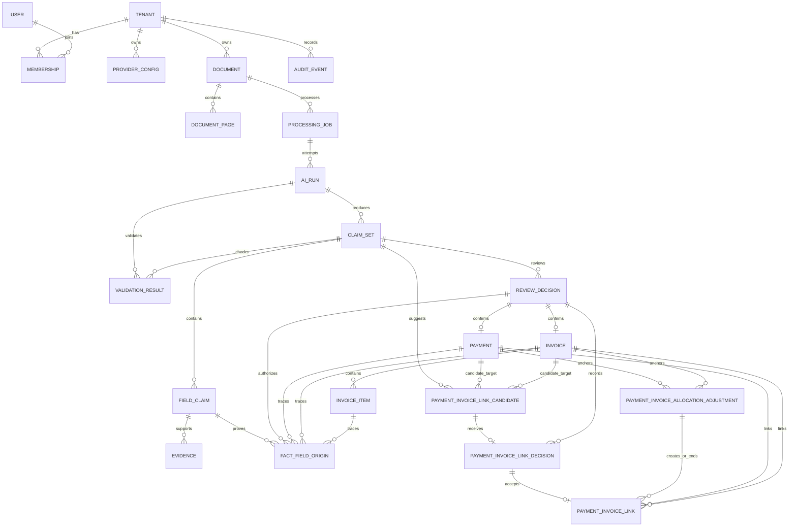

# 数据模型基线

ADR-0033 恢复激活：同一 PostgreSQL 中 `sbm_restore.state` 仅保存本次操作的格式版本、恢复 ID、数据库 OID/名称和唯一阶段；不属于业务 public Schema，不进 dump，不新增业务迁移。对象根 `restore-identity.json` 只保存对应身份、没有第二份阶段。普通未恢复库两者均不存在；恢复库两者必须匹配且数据库阶段为 complete。每次新恢复重新创建身份，历史业务数据不变。

B7/B8：`0008` 按 ADR-0031 增加双侧有界候选/余额索引和每端 200 活动 Link 上限；ADR-0032 使用 `fact_bad_debt_decisions` 最新不可变决定派生 Payment/Invoice 坏账状态，保留数据和纠错来源。不增加 Fact flag 投影或冗余 Trip 锁字段，状态变更与 Fact 版本跃迁由事务及提交约束绑定。

B6 已验收增补：[ADR-0030](decisions/0030-material-delivery-packages.md) 只读取现有活动归属或不可变报销条目/材料快照，不增加表或迁移。导出清单的公开字段不含 storage_key；初始 Review 只定位原件，不能替代旧快照未捕获的正式 Review。临时包 ID/句柄为进程内至多两个可过期资源，不能用于业务查询或恢复正式数据。

B5 增补（已本地验收、未发布）：`0007` 按 [ADR-0029](decisions/0029-member-account-lifecycle.md) 增加 Membership.version、单次邀请（仅 token hash）与全局账号审计。角色/状态变化撤销本租户会话，密码变化撤销全局会话；不保存租户级密码。邀请消费、成员变化和审计原子提交，现有用户与业务记录前向保留。

B4 增补（已本地验收）：`0006` 按 [ADR-0028](decisions/0028-invoice-supporting-materials.md) 新增发票辅助 Link/决定、报销材料快照与捕获标记。Document 仍是唯一不可变二进制身份，SHA 按租户去重；活动关联唯一，终止关系和历史快照保留，Invoice.version 绑定材料变更。历史报销仅标记未捕获，不回填当前附件或改旧 hash。

B3 增补（已本地验收）：`0005` 仅为 Payment/Invoice 增加 `(tenant_id, created_at DESC, id DESC) WHERE deleted_at IS NULL` 索引。入库时间/ID 已不可变，不新增排序表或字段；分页/详情均为现有 Fact、当前明细和活动 Link 的查询投影。来源身份只向获授权账号输出，见 [ADR-0027](decisions/0027-complete-fact-management.md)。

B2 增补（已本地验收）：Payment/Invoice/TripEvidence 保留首次 `source_review_decision_id`，新增 `current_review_decision_id` 表示当前字段修订，聚合 `version` 继续用于并发检查。不可变 `fact_corrections` 记录前后确认、理由、操作者、幂等请求与审计；完整历史字段只在 Claim 中保存。InvoiceItem 和 FactFieldOrigin 加入 ReviewDecision 作用域，保留旧明细/来源并限定当前查询。新报销项记录字段修订身份；旧快照不回填伪造来源或重算 hash。见 [ADR-0026](decisions/0026-confirmed-fact-correction.md)。

B1 增补（已本地验收）：[ADR-0025](decisions/0025-explicit-manual-review.md) 允许无 AI 根来源的初始人工 Claim，revised_by_user_id、人工接管理由与请求身份必填；AI 根来源规则保持。后续版本继承根来源，Evidence 可由用户显式标注同文档页码与摘录；不伪造 AiRun、自动摘录或 Fact。通过新增 0003 前向迁移保留现存记录。

状态：M0～M4 本地数据模型已完成；当前只实现 PostgreSQL 17 Clean Slate Schema
原则：全新 Schema，不读取、不迁移旧数据库

当前扩展：ADR-0024 新增 `0002`，分离人工 Trip 与 `trip_evidence_facts`，保留已发布 PostgreSQL 数据。容器管理、自动归属与材料关联有明确来源和不可变决定；下文原 Trip Fact 指凭证，当前结构以 ADR-0024 为准。已在隔离 PostgreSQL 17 完成数据库升级与集成验收，尚未应用到用户运行实例。

## 核心关系

M1、M2 实现上传单据、Claim/Fact 与分配链。M3 首切片新增 EmailSource、EmailMessage 和 EmailAttachment，第二切片新增 Trip 与归属实体，第三切片按 ADR-0016 新增报销快照、Finding 与状态历史；不存在预建空表或旧字段兼容。

## 通用约束

- 除全局 User 外，所有业务记录显式包含 `tenant_id`。
- ID 由系统生成；客户端提供的 ID 不作为授权依据。
- 创建、更新时间保存为 UTC Instant。
- 业务日期使用无时区日期类型；原始时区单独保存。
- Money 由 `minor_units int64` 和 `currency` 组成。M1 只接受 `CNY`、`USD`、`EUR`（2 位小数）和 `JPY`（0 位小数）；输入必须是普通十进制字符串且小数位不超过对应 exponent，额外小数位直接 Validation 阻断，禁止 float 与静默舍入。为保证 JSON API 与浏览器之间往返无精度损失，M1 的最小单位范围固定为 `0..9,007,199,254,740,991`，领域校验、Schema、数据库约束和前端输入共同执行该边界。
- 可变聚合使用 optimistic version，防止并发覆盖。
- 不在 JSON blob 中隐藏需要查询、授权或约束的核心字段。
- 外部输入的原始值与规范化值分开保存时，必须明确用途和保留策略。

## 身份与租户

### User

- id；
- 登录标识和认证材料；
- profile；
- created_at、updated_at。

### Tenant

- id；
- name；
- default currency/timezone；
- created_at、updated_at。

### Membership

- tenant_id、user_id；
- role：`owner`、`finance`、`reviewer` 或 `viewer`；
- status：`active` 或 `suspended`；
- created_at、updated_at。

只有 `active` Membership 能产生 TenantContext；跨租户访问始终拒绝。每个 Tenant 必须至少有一个 active owner，停用或降级最后一个 owner 的事务必须失败。

当前权限矩阵固定如下；`reviewer` 在审核上下文中只能读取当前 Document、Claim、证据和候选摘要，不能借此枚举完整账单或报销：

| 能力                                | owner | finance | reviewer | viewer |
| ----------------------------------- | ----- | ------- | -------- | ------ |
| 成员与角色管理                      | 是    | 否      | 否       | 否     |
| ProviderConfig 管理                 | 是    | 否      | 否       | 否     |
| 上传、收件箱、重试与取消            | 是    | 是      | 是       | 否     |
| Claim 修订、确认与驳回              | 是    | 是      | 是       | 否     |
| 当前审核的 Source/证据/关联候选摘要 | 是    | 是      | 是       | 否     |
| Payment/Invoice/Trip 列表与详情     | 是    | 是      | 否       | 是     |
| Trip 归属管理                       | 是    | 是      | 否       | 否     |
| Reimbursement 列表与详情            | 是    | 是      | 否       | 是     |
| Reimbursement 预检、提交与状态管理  | 是    | 是      | 否       | 否     |
| Document 聚合或 Fact 删除           | 是    | 否      | 否       | 否     |

空数据库只允许通过本地 `bootstrap-owner` 命令创建首个 User、Tenant 和 active owner Membership。命令必须在单一事务中完成，只在三张表都为空时可执行，重复执行明确失败；密码只从交互式标准输入或权限受限的挂载文件读取，不能出现在命令参数、环境变量或日志。该能力不暴露 HTTP 路由。首个 owner 登录后，后续用户与 Membership 只能通过带 `members.manage` 能力的受权用例创建。

## ProviderConfig

- tenant_id；
- base_url；
- encrypted_api_key；
- model；
- output_mode：`json_schema` 或 `json_object`；
- capability_status、capability_checked_at；
- capability_schema_version、capability_schema_sha256；
- active；
- version。

同一租户最多一个 `active = true` 的 ProviderConfig，由数据库部分唯一约束或等价事务约束保证。任何 Base URL、模型、密钥、显式输出模式或当前 Provider-facing Schema 身份变化都形成新配置并使旧检测结果不可复用；重新检测通过且记录的 Schema 版本与 SHA-256 和运行时完全一致前不能激活或执行。安全配置指纹包含 Base URL、模型、输出模式、密钥和 Provider-facing Schema 身份。M1 有效连接/请求/Job 超时固定为 10/60/150 秒，不存入租户配置。密文和主密钥不能位于同一数据源。API 输出永不返回密文或可恢复密钥材料。

## Source

### Document

- tenant_id；
- storage_key；
- original_name 的安全展示值；
- declared_mime、detected_mime；
- size_bytes；
- sha256；
- page_count；
- status；
- created_by、created_at。

Document 原件不可覆盖。M1 对 `tenant_id + sha256` 建唯一约束：同租户重复上传完全相同字节时返回稳定 `duplicate_document` 冲突和已有 Document ID，不创建第二个 Document/Job，也不静默合并；其他租户不可见。未来近似文件或业务重复判断不属于 M1。

### DocumentPage

- tenant_id、document_id、page_number；
- derived_image_storage_key；
- width、height；
- sha256；
- processing_version。
- visual_fingerprint_version；
- dhash64、ahash64；
- dhash_band_0 到 dhash_band_3。

页面图片和视觉指纹都是可重建派生物，不替代原始 Source。`page-visual-dedup/1` 的两个哈希固定为 16 位小写十六进制，四个 band 固定为各自 dHash 连续 16 位的无符号整数；数据库按同租户、版本和每个 band 建索引。任何算法或阈值变化都必须产生新版本，不能混用不同版本比较。

## Processing

### ProcessingJob

- tenant_id、document_id；
- kind；
- status；
- attempt_count；
- lease_owner、lease_expires_at；
- cancel_requested_at；
- error_code、safe_error_message；
- created_at、started_at、finished_at、version。

Job 状态遵循 `docs/architecture.md` 的状态机。运行中状态必须有租约，不能依赖孤立内存队列。

### AiRun

- tenant_id、job_id；
- provider_config_id；
- provider_config_version、provider_config_fingerprint；
- model；
- prompt_version、extraction_schema_version、provider_schema_version、provider_schema_sha256、claim_schema_version、claim_mapper_version、input_processing_version；
- request_hash、response_hash；
- token_usage；
- latency_ms；
- outcome、error_code；
- started_at、finished_at。

AiRun 追加写。重试创建新 AiRun，不覆盖失败 attempt。版本字段同时证明“模型看到了什么票面原文契约”和“本地使用哪一版确定性映射”；不得用单一 `schema_version` 混淆 Visible Text 与 Claim。

## Claim

### ClaimSet

- tenant_id、document_id、origin_ai_run_id；
- produced_by_ai_run_id 或 revised_by_user_id，必须且只能存在一个；
- document_type；
- status：`draft`、`ready_for_review`、`blocked`、`superseded`、`confirmed`、`rejected` 或 `cancelled`；
- revision；
- supersedes_claim_set_id，可为空；
- optimistic_version；
- created_at。

每条链只有第一个 revision 由对应 AiRun 的 Visible Text 经本地 Claim Mapper 产生：`origin_ai_run_id = produced_by_ai_run_id`；后续只允许用户修订并记录 `revised_by_user_id`，M1 不对已形成 ClaimSet 的 Job 重新调用模型。两种作者约束由数据库 Check 和外键保证，不能只靠日志推断。`tenant_id + document_id + revision` 唯一；数据库对 `draft`、`ready_for_review`、`blocked` 三种非终态按 `tenant_id + document_id` 建部分唯一约束。新 revision 必须指向被替代版本，并在同一事务中把旧版本置为 `superseded`。同一 Document 同时最多一个非终态 current revision，只有 `ready_for_review` 能被确认；`blocked` 必须继续修订、驳回或取消。`superseded`、`confirmed`、`rejected` 与 `cancelled` 为终态。

每个 ClaimSet revision 是完整、不可变的 `document-claim/3` 快照，不是增量补丁：当前 `document_type` 的 Schema 中每个字段都必须有且只有一个 FieldClaim，包括显式 `absent` 的可选字段；上一 revision 存在但当前 Schema 或明细已移除的路径也必须保留一个 `presence = absent` 墓碑。用户可以显式修正 `document_type`（`payment`、`invoice`、`trip` 或 `unknown`），以及新增、删除、修改或重排 InvoiceItem；`unknown` 不能进入 `ready_for_review` 或创建 Fact。创建用户 revision 的事务复制未修改字段、写入修改字段和墓碑、重跑校验并原子切换 current revision；读取、校验和 Fact 创建只读取当前 revision，禁止沿 supersedes 链补字段，Fact 只读取当前类型中 `present` 的正式字段。

### FieldClaim

- tenant_id、claim_set_id；
- field_path；
- value_type；
- presence：`present` 或 `absent`；
- typed value；
- normalized value；
- source：`ai` 或 `user`；
- source_user_id，可为空；
- supersedes_field_claim_id，可为空。

`tenant_id + claim_set_id + field_path` 唯一。`document_type` 本身使用固定路径且其 present typed value 必须等于所属 ClaimSet 的 `document_type`；InvoiceItem 由应用在首次接收时分配不可变 `item_key`，明细路径使用稳定键，例如 `items[{item_key}].amount_minor`，排序使用独立 `sort_order` 字段，不能用数组下标充当跨 revision 身份。`presence = absent` 时 typed/normalized value 必须为空且不携带 Evidence，`present` 时按 Schema 类型必填。`supplementary_fields` 使用 `supplementary` value type 保存模型发现的非核心键和 `other_fields`，最多 100 项、总 JSON 不超过 64 KiB；缺少逐项 Evidence 只警告，但格式错误必须阻断。该字段可审核、可修订，却不参与 Payment/Invoice Fact 构造或 Fact 字段来源。

初始 AI revision 的 `supersedes_field_claim_id` 全部为空。后续 revision 中，上一快照已存在的同路径 FieldClaim（包括 `absent` 墓碑）必须通过该字段指回；新 document type 或新增 InvoiceItem 首次引入的路径允许为空；删除字段、删除明细或切换类型时必须写入 `source = user` 的 `absent` 墓碑并指回旧路径。未修改字段复制上一 revision 的 source、source_user_id 与值；修改、新增和墓碑字段使用 `source = user`，其 `source_user_id` 必须等于当前 ClaimSet 的 `revised_by_user_id`。因此，未修改的用户值可以保留早期修改者，当前 revision actor 则始终由 ClaimSet 记录；`source = ai` 时 `source_user_id` 必须为空。金额、日期和标识符必须有确定类型，不能全部存成任意字符串。

### Evidence

- tenant_id、field_claim_id；
- document_page_id；
- quote，可为空；
- region，可为空；
- evidence_hash；
- copied_from_evidence_id，可为空。

关键字段至少具有 quote 或 region 之一。存在 Evidence 的未修改字段把 Evidence 复制到新 FieldClaim，并用 `copied_from_evidence_id` 指向前一条；用户新增或修改的关键字段必须显式选择同一 Document 中支持新值的证据。`absent` 墓碑不复制 Evidence。若当前类型的关键字段没有有效证据，或任何 ValidationResult 为 `error`/`blocked`，新 revision 与 Job 均进入 `blocked`；只有全部结果为 `passed`/`warning` 且证据齐全时才进入 `ready_for_review`/`needs_review`。Evidence 不作为授权边界，读取仍需 tenant 约束。

M2 的分页审核计划不是新实体或可写列。它在读取当前 Claim revision 时由 `FieldClaim.field_path -> Evidence.document_page_id -> DocumentPage.page_number` 唯一派生，包含完整页面序列、每页字段/明细及 InvoiceItem 页跨度。保存 revision 后只读取新 revision 的 Evidence 重算；不得沿 supersedes 链补页，也不得把客户端页状态写回 Claim 或 Fact。规范化单页读取同样只通过 `(tenant_id, document_id, page_number)` 查询既有 DocumentPage，不向 API 暴露 storage key。

M2 的多 Document 批量选择不增加 Batch、BatchItem 或批次状态表。每个成功项仍只产生既有不可变 Document 与一个 queued ProcessingJob；精确重复返回同租户既有 Document，失败项不产生记录。选择顺序、逐项进度和错误只属于当前 Web 页面内存，刷新后以 Document/ProcessingJob 为唯一权威状态，不得把临时批次反馈写回领域模型。

### ValidationResult

- tenant_id；
- ai_run_id 或 claim_set_id，必须且只能存在一个；
- field_claim_id，可为空且只允许用于 ClaimSet 级结果；
- rule_code；
- severity；
- status；
- safe_message；
- rule_version；
- created_at。

AiRun 级结果保存 JSON 解析或 Schema 失败，即使未能创建 ClaimSet 也可审计；ClaimSet 级结果保存字段与业务规则。规则代码稳定、可测试。UI 只展示结构化结果，不重新实现规则。

## Review

### ReviewDecision

- tenant_id、claim_set_id；
- actor_user_id；
- action：`confirm`、`reject` 或 `cancel`；
- association_mode：`allocate_candidates`、`reject_all` 或 `no_candidate`；只在 `confirm` 时必填；
- association_plan_hash，可为空；只在 `allocate_candidates` 时保存按候选 ID 排序的完整分配计划 SHA-256；
- duplicate_plan_hash；`confirm` 时必填，保存按 DuplicateCandidate ID 排序后的完整 resolution 计划 SHA-256；没有候选时也保存空计划的稳定哈希；
- idempotency_key；
- expected_revision；
- reason，可为空；
- created_at。

确认、Fact、重复候选决定、关联决定与零到多个 Link 在一个事务中创建。`tenant_id + idempotency_key` 唯一，重复请求只有在 Claim revision、关联模式、`association_plan_hash` 和 `duplicate_plan_hash` 均一致时返回原结果。服务端必须验证每个分配候选和重复候选唯一且属于当前 ClaimSet；有候选时不得缺少决定，没有候选时不得伪造决定。

## Fact

Payment 与 Invoice 共享可空的 `deleted_at`、`deleted_by_user_id` 和 `deletion_audit_event_id`。单项删除在同一事务中写这些字段与结构化 `fact_deleted` AuditEvent，并终止该 Fact 参与的活动 PaymentInvoiceLink；默认查询必须排除已删除 Fact 和已终止 Link，字段来源链、候选、决定与历史 Link 保持可审计。

Payment 与 Invoice 的 `allocated_minor`、`remaining_minor` 和 `allocation_status` 都是活动 PaymentInvoiceLink 的读取投影，不是可写列：已分配金额为活动 Link 的 `allocated_minor` 合计，剩余金额为 Fact 总额减该合计，状态按 0、部分和全部分配分别映射为 `unallocated`、`partial`、`allocated`。任何写路径都不得维护第二份余额。

### Payment

- tenant_id；
- source_review_decision_id；
- amount_minor、currency；
- merchant；
- transaction_time、source_timezone；
- business_date：确认时按 `transaction_time` 在 `source_timezone` 下的本地日期一次性计算并持久化；行程、关联、重复和报销读取同一列，禁止再次从时间字符串推导第二份日期；
- payment_method、order_number；
- category；
- created_at、updated_at、version。

### Invoice

- tenant_id；
- source_review_decision_id；
- invoice_number、normalized_invoice_number；
- invoice_date；
- total_minor、tax_minor、currency；
- seller_name、buyer_name；
- created_at、updated_at、version。

`normalized_invoice_number` 固定使用 Unicode NFKC、去除首尾空白、连续空白折叠为一个、拉丁字母大小写折叠。M1 对未删除 Invoice 的 `tenant_id + normalized_invoice_number` 建部分唯一约束；当前 Claim 命中已有号码时产生 `duplicate_invoice_number` blocked ValidationResult，不能确认 Fact。M2 只扩展近似、字段组合和跨页重复检测，不改变 M1 的精确规则。

### InvoiceItem

- tenant_id、invoice_id、item_key；
- name；
- quantity 和 unit；
- unit_price_minor、amount_minor、tax_minor；
- sort_order。

`item_key` 继承被确认 Claim revision 的稳定键，`tenant_id + invoice_id + item_key` 唯一；重排只改变 `sort_order`，不改变字段来源路径。

在 Claim 阶段，所有 present InvoiceItem 的 `sort_order` 必须唯一且构成 `0..n-1`。同一 item 的非排序字段 Evidence 可以位于相邻多页；其有序去重页码必须连续，且按 `sort_order` 读取时 item 页跨度不能倒退。Fact 不复制 `start_page`、`end_page` 或页面列表；这些信息始终通过 FactFieldOrigin 回到被确认 FieldClaim 的 Evidence，避免第二份来源。

### DuplicateCandidate

- tenant_id、claim_set_id；
- kind：`near_file`、`cross_page` 或 `field_combination`；
- existing_document_id、current_document_page_id、existing_document_page_id、existing_payment_id、existing_invoice_id，按 kind 采用严格互斥形状；
- candidate_key、rule_version；
- reason_codes；
- dhash_distance、ahash_distance，只在视觉候选中存在；
- created_at。

候选是 Claim revision 的不可变审核输入。`near_file` 只指向同租户另一个 Document；`cross_page` 指向当前 Document 内两个不同页，或当前页与同租户另一 Document 页；`field_combination` 只指向一个活动 Payment 或 Invoice。目标引用在生成时由数据库触发器验证租户和形状，但允许目标后来物理删除或软删除，历史候选仍保留并在读取时显示 `available = false`，不能因此泄露其他租户是否存在同 ID。

视觉候选只保存版本、ID、页码和两种 Hamming 距离；字段候选只保存目标 ID 与原因代码。候选不得复制原始图片、完整模型响应或完整目标财务字段。`candidate_key` 由租户、ClaimSet、kind、规则版本和适用目标/页对确定性计算；同一 revision 最多 50 个，超过时 Claim blocked。

### DuplicateCandidateDecision

- tenant_id、candidate_id、review_decision_id；
- action：当前只允许 `keep_distinct`；
- created_at。

每个 DuplicateCandidate 最多一个决定，且必须属于同一 ClaimSet 的 `confirm` ReviewDecision。用户驳回当前 Claim 时不创建 DuplicateCandidateDecision；确认时则必须为当前 revision 的全部候选写入决定。数据库在 Claim 切换为 `confirmed` 前验证决定集合完整，不能由模型、后台任务或普通 Repository 绕过。

### PaymentInvoiceLinkCandidate

- tenant_id、claim_set_id；
- existing_payment_id 或 existing_invoice_id，必须且只能存在一个；
- candidate_key、rule_version；
- reason_codes、name_exact、date_distance_days；
- created_at。

候选是不可变审核输入：当前 ClaimSet 是 Payment 时只能引用已确认 Invoice，当前 ClaimSet 是 Invoice 时只能引用已确认 Payment。目标在生成时必须同租户、未删除、币种一致、活动剩余金额大于零，两个业务日期相差不超过 30 天；金额完全相等只写入原因代码。`candidate_key` 由租户、ClaimSet、目标 Fact 和规则版本确定并唯一，使同一输入重复计算不产生第二个候选。名称规范化固定为 Unicode NFKC、去除首尾空白、连续空白折叠为一个、拉丁字母大小写折叠，只能影响稳定排序和警告，不能放宽硬条件。

Review 读取候选时从目标 Fact 与活动 Link 动态计算 `amount_minor`、`allocated_minor`、`remaining_minor` 和 `available`；这些值不写回候选表，也不能替代确认事务内的再次计算。已删除或余额为零的目标仍可作为不可变候选历史返回，但 `available = false` 且不能被选择。

### PaymentInvoiceLinkDecision

- tenant_id、candidate_id、review_decision_id；
- action：`accept` 或 `reject`；
- allocated_minor、currency；只有 `accept` 时非空且金额必须为正；
- created_at。

每个候选最多一个终态决定。分配计划中出现的候选写 `accept + allocated_minor + currency`，同次审核展示的其余候选写 `reject` 且分配字段为空；选择“不关联任何候选”时全部写 `reject`。决定必须与同一 ClaimSet 的 `confirm` ReviewDecision 一起提交，不能由后台任务或模型创建。

### PaymentInvoiceLink

- tenant_id；
- payment_id、invoice_id；
- link_decision_id 或 created_by_adjustment_id，必须且只能存在一个；
- allocated_minor、currency；
- created_at；
- ended_at、ended_by_audit_event_id、ended_by_adjustment_id；活动时全部为空，终止时后两者必须且只能存在一个。

初次审核中只有 `accept` PaymentInvoiceLinkDecision 能产生 Link，且 Link 的金额与币种必须和决定完全一致；已确认 Fact 的独立调整则只能由 PaymentInvoiceAllocationAdjustment 产生，且 adjustment anchor 必须是 Link 的一端。`allocated_minor` 为正整数最小单位，`currency` 必须与 Payment 和 Invoice 同时一致。数据库对活动 `tenant_id + payment_id + invoice_id` 建唯一约束，并分别对非空 `tenant_id + link_decision_id` 与 `tenant_id + created_by_adjustment_id + payment_id + invoice_id` 建永久唯一约束；同一 Fact 可通过不同活动对参与多条 Link。

数据库在插入 Link 前重算双方活动分配合计：`payment active allocated + NEW.allocated_minor <= payment.amount_minor`，`invoice active allocated + NEW.allocated_minor <= invoice.total_minor`。任一 Fact 已删除、币种不一致、决定不匹配或余额不足时拒绝插入。应用层执行同一规则以返回稳定业务错误，数据库约束负责防止并发绕过。

Link 不原地改写金额或关系，也不允许普通业务写路径物理删除。删除任一 Fact 时，同一事务以 `fact_deleted` AuditEvent 终止其全部活动 Link，不删除候选、决定或历史 Link；独立分配调整以 Adjustment 终止撤销或替换的旧 Link，并为新增或变化的对创建新 Link。未变化 Link 保持原 ID 和来源。未删除另一端的余额始终从活动 Link 自然恢复。未来整租户物理清除必须使用单独的受控清除机制，在核验租户范围并生成删除清单后处理 Link 历史保护约束，不能复用普通 Link 删除入口。

### PaymentInvoiceAllocationAdjustment

- tenant_id、actor_user_id；
- anchor_fact_type：`payment` 或 `invoice`；
- anchor_payment_id 或 anchor_invoice_id，必须与类型一致且只能存在一个；
- mode：`supplement`、`withdraw` 或 `replace`，由前后完整计划差异派生；
- idempotency_key、request_hash；
- expected_plan_hash、resulting_plan_hash；
- reason；
- audit_event_id；
- created_at。

Adjustment 是用户对已确认 Fact 活动分配计划作出的不可变业务决定，不是余额、候选或 Fact 字段的副本。`tenant_id + idempotency_key` 永久唯一；同键请求只有 request hash 完全一致才能重放。前后计划 hash 均使用 `payment-invoice-allocation-plan/1`，请求 hash 使用 `allocation-adjustment-request/1`。

数据库要求 actor 是同租户 Membership、anchor 存在且未删除、类型与外键形状一致、两个 hash 为 64 位小写十六进制、理由 trim 后 1–500 字符，并禁止 UPDATE/DELETE。Adjustment 产生或终止的 Link 反向引用该记录；查询这些 Link 即可恢复本次创建和终止 ID，不再复制一份明细表。AuditEvent 的安全 metadata 只保存模式和数量，完整理由只保存在该受租户隔离的业务表。

### FactFieldOrigin

- tenant_id；
- payment_id、invoice_id 或 invoice_item_id，必须且只能存在一个；
- field_path；
- field_claim_id；
- review_decision_id；
- created_at。

每种 Fact 外键分别以 `tenant_id + fact_id + field_path` 唯一，并由数据库外键保证目标存在。创建 Payment、Invoice 或 InvoiceItem 的事务必须为每个正式字段写入一条来源映射；映射的 FieldClaim 必须属于被该 ReviewDecision 确认的当前 ClaimSet。Fact 聚合上的 `source_review_decision_id` 证明整体授权，FactFieldOrigin 证明字段级来源，两者都不能省略。

## AuditEvent

- tenant_id；
- actor_user_id，可为空表示系统；
- action；
- resource_type、resource_id；
- request_id；
- safe metadata；
- created_at。

AuditEvent 追加写，不保存密钥、完整单据、完整模型输出或证据正文。

## M3 与后续领域

### EmailSource（M3 首切片）

- tenant_id、id；
- display_name；
- mailbox_address_normalized；
- imap_host_normalized、imap_port；
- transport_security：`implicit_tls` 或 `starttls`；
- status：`pending_connection` 或 `active`；
- idempotency_key、request_hash；
- created_by_user_id、created_at、last_archived_at、version。

Source 描述符不包含密码、OAuth、Token、Cookie、密文、密钥引用或可恢复凭据。`tenant_id + idempotency_key` 和规范连接身份分别唯一；记录只追加创建，当前切片没有修改连接配置的第二入口。

### EmailMessage

- tenant_id、id、email_source_id；
- external_message_key：未来连接器对稳定服务器身份元组计算的 64 位不可逆键；
- raw_storage_key、raw_sha256、raw_size_bytes；
- subject、sender_address、sent_at，可为空；received_at 必填；
- status：`archived` 或 `blocked`；safe_error_code，可为空；
- created_at。

`tenant_id + email_source_id + external_message_key` 唯一。相同键只允许相同 `raw_sha256` 严格重放；任何原始字节、头投影或状态都不得更新。邮件正文只存在原始对象中，不复制到数据库。

### EmailAttachment

- tenant_id、id、email_message_id、part_index；
- storage_key、original_name 的安全展示值、declared_mime、disposition；
- size_bytes、sha256；
- processing_status：`queued`、`existing_document` 或 `archived_only`；
- safe_reason_code，可为空；document_id，可为空；
- created_at。

`tenant_id + email_message_id + part_index` 唯一。附件对象不可覆盖；同租户精确重复可以链接已有 Document。邮件拥有附件对象，Document 删除不能删除该对象；删除未确认的邮件来源 Document 时附件的 `document_id` 置空，邮件归档继续存在。

### Document 来源扩展

Document 增加 `ingestion_kind = upload | email_attachment` 与 `original_object_owner = document | email_attachment`。手工上传固定为 `upload/document`；邮件新建 Document 固定为 `email_attachment/email_attachment` 并继续保存 Source 创建者作为授权摄取主体。ProcessingJob、AiRun、Claim、Review 与 Fact 不增加邮件专用分支。

### Trip（ADR-0024 人工行程容器）

- tenant_id、id、name、start_date、end_date、timezone、notes；
- origin_kind：`manual | migrated_review`；last_management_decision_id；
- created_at、updated_at、version 与软删除元数据。

容器不属于 Fact，不持有审核来源。新建必须明确 IANA 时区；迁移的旧容器允许空时区，但不参与自动归属。TripManagementDecision 以不可变管理快照、期望/结果版本、actor、理由、幂等键及 AuditEvent 记录创建、编辑、删除。模型不能创建容器。

### TripEvidence（`trip_evidence_facts`）

- tenant_id、id、source_review_decision_id；
- origin，可为空；destination；
- start_date、end_date；
- traveler_name、transport_type、booking_reference，可为空；
- created_at、updated_at、version；
- deleted_at、deleted_by_user_id、deletion_audit_event_id。

TripEvidence 与 Payment/Invoice 一样只能由对应类型的 confirmed ReviewDecision 创建；`destination + start_date + end_date` 必填且 `end_date >= start_date`。票面字段不可改写，删除采用软删除并保留字段来源与审核链。地点、姓名和预订编号是租户私有业务字段，不进入 safe metadata。

### TripMaterialDecision / TripMaterialLink

凭证归属与费用分开存储，不产生虚拟金额。Decision 保存凭证、actor、来源 `manual | migration`、前 Link、目标行程、期望凭证版本、动作、理由、幂等键及审计。迁移来源仅允许 `0002` 初始化，运行时只能写人工决定。每个凭证最多一条活动 Link，容器可以有多条；移动必须由同一决定结束前 Link 并建立新 Link。删除容器或凭证只终止对应 Link，历史不可改写或删除。

### TripFactAssignmentDecision

- tenant_id、id、actor_user_id；
- fact_type：`payment | invoice`，以及严格二选一的 payment_id / invoice_id；
- previous_assignment_id，可为空；desired_trip_id，可为空；
- action：`assign | move | unassign`；
- idempotency_key、request_hash、reason；
- audit_event_id、created_at。

Decision 另保存 `decision_source = manual | automatic`、`expected_fact_version` 和自动决定的 `rule_version = trip-time-attribution/1`。Payment 使用 `trip_assignment_mode = auto | manual | blocked`，复用现有 Fact version 进行归属并发控制；旧决定的版本缺失仅保留为历史，运行时新写入必须匹配实际版本。

Decision 不可更新或删除。assign 要求无 previous 且有目标，move 要求有 previous 且有不同目标，unassign 要求有 previous 且目标为空。`tenant_id + idempotency_key` 永久唯一；reason 为 1～500 字符的租户私有业务说明，不写 AuditEvent。

### TripFactAssignment

- tenant_id、id、trip_id；
- payment_id / invoice_id 严格二选一；
- created_by_decision_id、created_at；
- ended_at、ended_by_decision_id、ended_by_audit_event_id，可为空。

每个 Payment 或 Invoice 同时最多一条活动 Link。创建字段不可变；活动 Link 只允许一次性终止，终止来源严格二选一为后续 AssignmentDecision 或 Fact 删除 AuditEvent。历史 Link 禁止删除，活动 Link 是当前行程归属的唯一数据源。

### FactFieldOrigin 与 ReviewDecision 扩展

FactFieldOrigin 的可空 `trip_id` 指向 `trip_evidence_facts`，继续保证 Payment、Invoice、InvoiceItem、TripEvidence 四者严格单选，不指向人工容器。ReviewDecision 的 `fact_type=trip` 表示审核凭证，不能绕过来源创建材料或容器；三类确认仍要求完整疑似重复计划。

### Reimbursement（M3 第三切片）

- tenant_id、id、trip_id；
- trip_name、trip_start_date、trip_end_date、trip_timezone、trip_version 快照；旧快照新增的时区/版本为空，原显示值与 hash 保留；
- status：`submitted | reimbursed | rejected`；
- policy_rule_version：新提交固定 `reimbursement-policy/2`；保留历史 `/1`；
- materials_captured、material_count：新提交明确捕获精确集合和数量，历史为 false/null，不回填当前材料；数量不可变且与材料快照子表行数以延迟约束核对；
- snapshot_hash；
- created_by_user_id、created_at、updated_at、version。

Reimbursement 不是 Document Fact，不持有 source_review_decision_id，也不改变 Payment、Invoice 或 Trip。Trip 摘要是提交时的不可变历史快照；当前状态和 version 是唯一可变字段，只能通过匹配的 ReimbursementStatusDecision 在同一事务内推进。一个 Trip 同时最多一个 submitted 记录，Reimbursement 不删除。

### ReimbursementItem

- tenant_id、id、reimbursement_id、trip_fact_assignment_id；
- fact_type：`payment | invoice`，以及严格二选一的 payment_id / invoice_id；
- display_name、business_date、amount_minor、currency 的提交时快照；
- sort_order、created_at。

每个 Reimbursement 含 1～200 个 Item；Assignment 和 Fact 身份在同一记录内一致且不得重复。金额始终为整数最小单位，混合币种只按币种分别聚合。Item 快照只解释历史报销，不参与当前 Fact、余额或归属计算；Fact 或 Assignment 后续软删除/终止不删除 Item。

### ReimbursementPolicyFinding

- tenant_id、id、reimbursement_id、item_id；
- finding_key、rule_version、code：`missing_invoice | amount_conflict | duplicate_reimbursement`；
- expected_minor、actual_minor、currency，可按 code 为空；
- related_reimbursement_id、related_reimbursement_status，可按 code 为空；
- created_at。

Finding 由提交事务使用当前 `reimbursement-policy/2` 重算并冻结，历史 `/1` 保留；创建字段不可变且不可删除。`finding_key` 由规则输入确定性产生，在同一 Reimbursement 内唯一；最多 1,000 条，超过时明确拒绝而非截断。预检 Finding 不落库。

### ReimbursementStatusDecision

- tenant_id、id、reimbursement_id、actor_user_id；
- previous_status，可为空；desired_status；expected_version、result_version；
- action：`submit | mark_reimbursed | reject | reopen`；
- idempotency_key、request_hash、reason；
- audit_event_id、created_at。

首次 submit 固定从空状态到 submitted、result_version 为 1；后续只允许 submitted 到 reimbursed/rejected，或两个终态重新打开到 submitted。Decision 不可更新或删除；`tenant_id + idempotency_key` 永久唯一，`tenant_id + reimbursement_id + result_version` 唯一。reason 是 1～500 字符租户私有说明，不写 AuditEvent。

## FactInsightProjection（M4 首切片，只读）

FactInsightProjection 不是数据库实体，只在一次 PostgreSQL `REPEATABLE READ READ ONLY` 事务和单次 API 响应内存在：

- fact_type：`payment | invoice`，以及对应唯一 fact_id；
- business_date：Payment 使用持久化 `business_date`，Invoice 使用 `invoice_date`；
- display_name：Payment 商户或 Invoice 卖方的当前安全摘要；
- amount_minor、allocated_minor、remaining_minor、currency；
- allocation_status：`unallocated | partial | allocated`；
- 可选当前 Trip：trip_id、destination、start_date、end_date。

当前 allocated_minor 只从活动 PaymentInvoiceLink 聚合；当前 Trip 只从活动 TripFactAssignment 读取。投影不保存 Source、Claim、Evidence、邮件、Provider、Reimbursement 快照或删除资源内容，不允许反向写回 Fact。汇总按币种与 fact_type 分别包含数量、总额、已分配、剩余和状态数量；它同样不是表、缓存或第二数据源。规范版本固定为 `fact-insights/1`，游标版本固定为 `fact-insight-cursor/1`。

## BackupManifestV2（M4 第二切片，离线制品）

BackupManifestV2 不是数据库实体或运行时第二数据源，只描述一次停机快照。规范身份固定为 `smart-bill-manager-backup/2`：

- backup_set_id（128-bit 随机小写十六进制）、created_at、migration_set_sha256、schema_sha256；
- PostgreSQL dump 的相对路径、size_bytes、sha256、服务端/工具 major、Schema/约束身份与恢复验证结果；
- 按表名排序的全部 table_counts，以及 audit_chain_sha256；
- document_count、object_reference_count、unique_object_count；
- 按安全相对路径排序且唯一的 ObjectFileRecord：path、size_bytes、sha256。

清单不包含主密钥、密钥哈希、凭据、Cookie、业务字段或原始响应。单独的认证标签使用独立主密钥经固定域分离后对清单原始字节计算 HMAC-SHA-256。清单、标签与数据包不能自行恢复或伪造认证；操作者必须从独立数据源提供同一既有主密钥。

对象引用行可以因 EmailAttachment 与其 Document 共享原件而重复，但同一 storage_key 的 SHA-256 和已知大小必须一致；unique_object_count 是去重后的物理集合，且必须精确等于数据包和恢复对象根的文件集合。`staging/`、`trash/`、运行锁和永久 `restore-state` 都不属于备份对象。

离线恢复先逐字验证该快照；随后 sessions 被强制清空，因此激活前最终状态要求除 sessions 从清单值变为 0 外，其余表数量、Schema、审计链和对象集合不变。恢复过程不把该预期安全变化写回原清单。演练另在受保护快照中冻结既有非 Session 行的确定性摘要与 append-only 表前缀计数；这些不是运行时实体或第二数据源，只用于证明首次启动后的新增行全部闭合到唯一恢复任务。

## 删除与保留

- M1 默认不自动过期 Document、AiRun、Claim、Review、AuditEvent 或 Fact。
- 未形成 Fact 的 Document 聚合允许租户所有者显式物理删除；删除覆盖原件、派生页、Job、AiRun、Claim、Evidence、ValidationResult 和未决定的关联候选，只保留不含文件名、证据正文和财务字段的删除审计墓碑。
- 邮件附件拥有的原件对象不随未确认 Document 删除；删除事务只移除 Document 及其派生聚合并把 EmailAttachment 的 Document 链接置空。EmailMessage、EmailAttachment 和归档对象继续按邮箱 Source 保留策略存在。
- 已确认 Fact 的单项删除写入结构化 `fact_deleted` AuditEvent 和 Fact 删除标记；Source、Claim、FactFieldOrigin 和 Review 链在租户存在期间保留，避免产生不可解释的历史正式数据。
- 删除 Payment/Invoice 使用 Fact 删除 AuditEvent 终止其费用 Link；删除容器使用独立 `trip_workspace_delete` 审计终止该容器费用/材料 Link。删除 TripEvidence 只终止材料 Link，不能用相同 ID 删除容器或费用。
- 删除 Trip、Payment 或 Invoice 不删除已有 Reimbursement、Item、Finding 或 StatusDecision；详情使用冻结快照并标明来源已删除。已删除资源不能进入新的预检或提交。
- 删除 ProviderConfig 时立即删除对应密文；已有 AiRun 只保留不可逆安全指纹，不保留可恢复凭据。
- 删除整个租户时物理删除全部业务行、对象文件、派生物、审计链和密钥材料，并输出按资源类型计数与对象哈希组成的删除清单。
- 备份副本不接受应用内逐条修改；部署说明必须声明备份保留与销毁策略，过期备份整体销毁。恢复已删除租户的备份时，必须先重放租户删除清单，不能让已删除数据重新可见。
